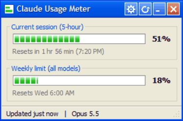

# Claude Usage Meter

A tiny Windows XP–style desktop widget that shows your Claude Code plan usage — the same 5-hour session and weekly limits you see in `/usage` — live, in the corner of your screen.



- **Session and weekly bars** with a reset countdown, turning yellow at 75% and red at 90%
- **Live taskbar button**: the icon is a mini progress bar that fills with your session usage, and Windows' own taskbar progress indicator tracks it too (hover for both numbers)
- **Sits bottom-right**, always on top (toggleable), draggable, remembers where you put it
- **Live**: checks your usage every 2 minutes, and whenever you click ↻, without using any of your plan (see below)
- No dependencies beyond Python and Pillow; no API keys to set up

## How it works

Claude Code sends session JSON — including `rate_limits.five_hour` and `rate_limits.seven_day` — to your [status line](https://code.claude.com/docs/en/statusline) script on every refresh. `statusline.py` saves those numbers to `latest.json` and prints a short status line; `widget.pyw` watches that file and draws the meter.

Rate-limit data is only available to Claude Pro and Max subscribers, and the widget needs a Claude Code login on this machine. If it can't check, it keeps the last reading and shows how old it is; a window drops to 0% once its reset time passes.

Every open Claude Code session writes to the same file, and an idle one still carries the numbers from its last request. `statusline.py` ignores a reading that's lower than the saved one in the same window (usage only goes up until a reset), so a stale session can't roll the meter back.

### Live checks

Claude Code only learns your usage when it makes a request, so usage from elsewhere (claude.ai, the desktop app) wouldn't show up until a session sends something. So every 2 minutes, and whenever you click ↻, the widget asks the same endpoint Claude Code's `/usage` command uses, signed in with the login Claude Code saved in `~/.claude/.credentials.json`. No model runs, so checks don't use any of your plan. The token is only sent to `api.anthropic.com`.

That login expires every few hours, and the widget doesn't renew it itself, since that could conflict with Claude Code. When it finds the login expired, it runs one tiny headless request instead (`claude -p` on Haiku with no tools, MCP servers, settings or saved session). That gets current numbers, and Claude Code renews the login along the way. Automatic checks do this at most every 15 minutes.

The endpoint isn't a documented API, so an update could change it. If it stops working, clicking ↻ still gets fresh numbers through the headless request, and the meter still fills from the status line as before. To change how often it checks, set `"poll_minutes"` in `config.json` next to the widget (default `0.5`, i.e. every 30 seconds; `0` turns automatic checks off).

### Keep the 5-hour window running

Your 5-hour window only starts when you send a request. Click the gear button next to ↻ (or right-click → *Settings...*), tick **Keep my 5-hour window running**, and the widget sends one tiny headless request (the same `claude -p` on Haiku as above) so a new window starts even if you're away from the keyboard. Choose the cycle there: **when the window runs out** (the default), or **every N hours** (0.25 to 24). Tick **Start the cycle at** and enter a time (24-hour, e.g. `05:00`) to anchor the schedule: nothing is sent until that time, so you can set it the night before and your windows line up from then on (with *every N hours*, requests go out at that time plus each multiple of N hours; with *when the window runs out*, the first goes out at that time and the rest follow each reset). It's off by default, and unlike the free usage checks, each of these uses a sliver of your plan. The widget has to be running and your PC awake; it sends at most one request per 10 minutes. The same settings live in `config.json` as `"keep_alive"` and `"keep_alive_hours"`.

## Requirements

- Windows 10 or 11
- Python 3.9+ with Tkinter (included in the python.org installer)
- [Pillow](https://pypi.org/project/pillow/): `pip install pillow`
- Claude Code with a Pro or Max plan

## Setup

1. **Clone the repo** somewhere permanent:

   ```powershell
   git clone https://github.com/HaydenHarms/claude-usage-meter.git
   ```

2. **Point Claude Code's status line at `statusline.py`** by adding this to `~/.claude/settings.json` (use your own paths):

   ```json
   "statusLine": {
     "type": "command",
     "command": "\"C:/path/to/python.exe\" \"C:/path/to/claude-usage-meter/statusline.py\""
   }
   ```

   This replaces any status line you already have. Your status line will read like `Opus 5.5 | ctx 34% | 5h 48% | 7d 17%`.

3. **Launch the widget**: double-click `widget.pyw`, or run `pythonw widget.pyw`. Send a message in Claude Code and the bars fill in.

4. **Optional — start at login**: press `Win+R`, run `shell:startup`, and put a shortcut there with target
   `"C:\path\to\pythonw.exe" "C:\path\to\claude-usage-meter\widget.pyw"` (set its icon to `icon.ico`).

## Usage

- **Drag** the title bar to move it; **right-click** anywhere for *Always on top*, *Move to bottom-right*, *Refresh now* and *Exit*.
- **Click ↻** in the title bar to check right away. The status bar shows *Checking usage...* and then the result, or the reason if it failed.
- Launching it again brings the running window forward instead of opening a second one.
- **Don't pin it to the taskbar.** Windows shows a pinned item's static shortcut icon, which replaces the live progress icon (and pins bare Python). Use start-at-login instead so the button is always there.

## Files

| File | Purpose |
| - | - |
| `widget.pyw` | The widget window |
| `statusline.py` | Claude Code status line script; writes `latest.json` (the widget reuses it to save refreshes) |
| `icon.ico` / `make_icon.py` | App icon and the script that draws it |

## License

[MIT](LICENSE)
