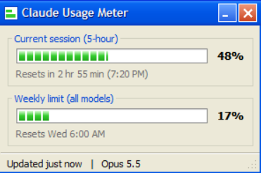

# Claude Usage Meter

A tiny Windows XP–style desktop widget that shows your Claude Code plan usage — the same 5-hour session and weekly limits you see in `/usage` — live, in the corner of your screen.



- **Session and weekly bars** with a reset countdown, turning yellow at 75% and red at 90%
- **Live taskbar button**: the icon is a mini progress bar that fills with your session usage, and Windows' own taskbar progress indicator tracks it too (hover for both numbers)
- **Sits bottom-right**, always on top (toggleable), draggable, remembers where you put it
- No dependencies beyond Python and Pillow; no API keys, no network calls

## How it works

Claude Code sends session JSON — including `rate_limits.five_hour` and `rate_limits.seven_day` — to your [status line](https://code.claude.com/docs/en/statusline) script on every refresh. `statusline.py` saves those numbers to `latest.json` and prints a short status line; `widget.pyw` watches that file and draws the meter.

Rate-limit data is only available to Claude Pro and Max subscribers, and the meter updates while Claude Code is in use. When you step away it keeps the last reading and shows how old it is; a window drops to 0% once its reset time passes.

## Requirements

- Windows 10 or 11
- Python 3.9+ with Tkinter (included in the python.org installer)
- [Pillow](https://pypi.org/project/pillow/): `pip install pillow`
- Claude Code with a Pro or Max plan

## Setup

1. **Clone the repo** somewhere permanent:

   ```powershell
   git clone https://github.com/HaydenHarms/claude-usage-meter.git
   ```

2. **Point Claude Code's status line at `statusline.py`** by adding this to `~/.claude/settings.json` (use your own paths):

   ```json
   "statusLine": {
     "type": "command",
     "command": "\"C:/path/to/python.exe\" \"C:/path/to/claude-usage-meter/statusline.py\""
   }
   ```

   This replaces any status line you already have. Your status line will read like `Opus 5.5 | ctx 34% | 5h 48% | 7d 17%`.

3. **Launch the widget**: double-click `widget.pyw`, or run `pythonw widget.pyw`. Send a message in Claude Code and the bars fill in.

4. **Optional — start at login**: press `Win+R`, run `shell:startup`, and put a shortcut there with target
   `"C:\path\to\pythonw.exe" "C:\path\to\claude-usage-meter\widget.pyw"` (set its icon to `icon.ico`).

## Usage

- **Drag** the title bar to move it; **right-click** anywhere for *Always on top*, *Move to bottom-right*, *Refresh* and *Exit*.
- Launching it again brings the running window forward instead of opening a second one.
- **Don't pin it to the taskbar.** Windows shows a pinned item's static shortcut icon, which replaces the live progress icon (and pins bare Python). Use start-at-login instead so the button is always there.

## Files

| File | Purpose |
| - | - |
| `widget.pyw` | The widget window |
| `statusline.py` | Claude Code status line script; writes `latest.json` |
| `icon.ico` / `make_icon.py` | App icon and the script that draws it |

## License

[MIT](LICENSE)
